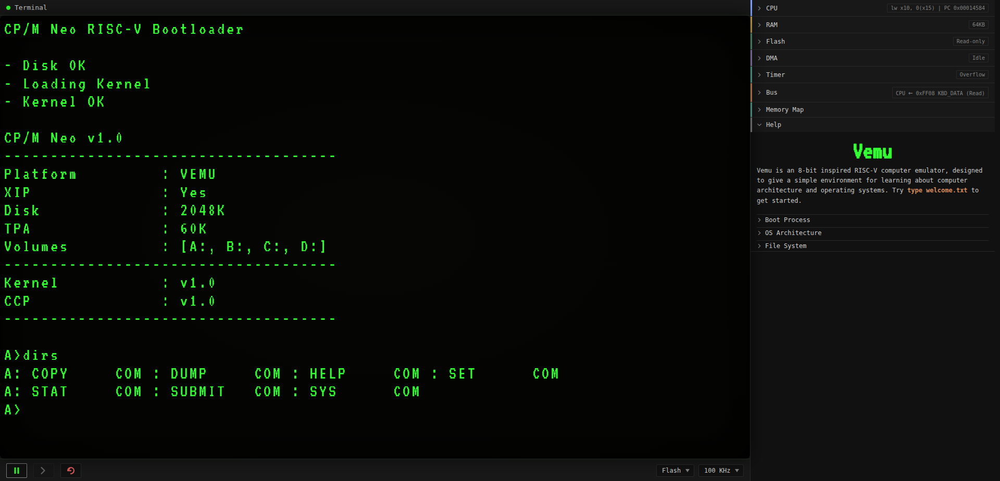
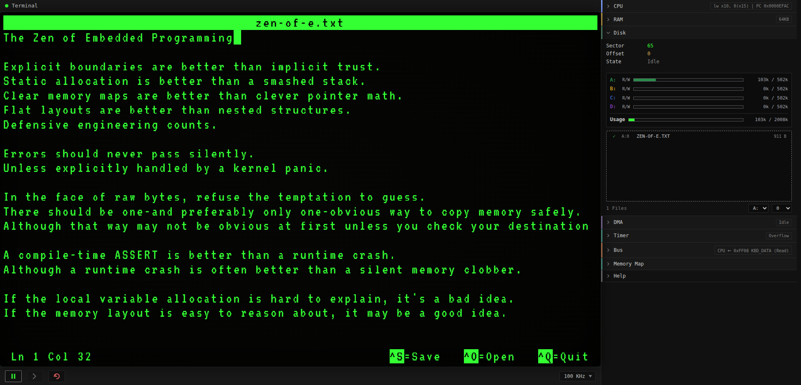

<div align="center">

# Vemu

**A RISC-V microcomputer emulator running CP/M Neo in the browser**

An 8-bit inspired RISC-V computer emulator, designed to give a simple environment for learning about computer architecture and operating systems.

[](https://mazin-o3.github.io/vemu/)
[](LICENSE)
</div>

<p align="center">
  
</p>

## Overview

Vemu simulates a self-contained 32-bit hardware environment inside the browser.

## Hardware Specification

Vemu emulates a custom 32-bit RISC-V microcomputer:

| Component | Specification |
|---|---|
| **CPU** | RV32I + M extension for hardware multiplication and division |
| **RAM** | 64 KB, byte-addressable (`0x0000`–`0xFEFF`) |
| **Memory-mapped I/O** | Top page `0xFF00`–`0xFFFF` |
| **Storage** | 2 MB CP/M Neo disk|
| **System clock** | Selectable 50 kHz – 1 MHz |


## Register Map

| Addr    | Name          | Access | Description                                 |
|---------|---------------|--------|---------------------------------------------|
| `0xFF00`| `DISK_BUFFER` | R/W    | 512-byte sector buffer; each read/write advances the buffer offset |
| `0xFF04`| `DISK_SECTOR` | W      | Select sector: `[15]` write flag, `[14:0]` LBA |
| `0xFF08`| `KBD_DATA`    | R      | Pop next key, `[6:0]` ASCII (bit 7 cleared) |
| `0xFF0C`| `KBD_STATUS`  | R      | `[0]` = 1 if a key is ready; read does not consume |
| `0xFF10`| `DSP_DATA`    | W      | Write a character to the text display       |
| `0xFF14`| `CLK_KHZ`     | R      | System clock frequency in kHz               |
| `0xFF18`| `TIMER_CSTR`  | R/W    | Timer control/status (see bit table)        |
| `0xFF1C`| `TIMER_CNTR`  | R/W    | 16-bit timer counter (writes set it)         |
| `0xFF20`| `DMA_SAR`     | R/W    | DMA source address (16-bit)                 |
| `0xFF24`| `DMA_DAR`     | R/W    | DMA destination address (16-bit)            |
| `0xFF28`| `DMA_WCR`     | R/W    | DMA word count (16-bit)                     |
| `0xFF2C`| `DMA_CSTR`    | R/W    | DMA control (write) / status (read)         |

### DMA_CSTR — `0xFF2C`

Write:

| Bit | Field   | Description                        |
|-----|---------|------------------------------------|
| 0   | START   | Write 1 toggles the transfer on/off |
| 1   | STREAM  | 1 = stream mode (bus-locked)       |
| 2   | SRC_INC | Auto-increment source address      |
| 3   | DST_INC | Auto-increment destination address |
| 5:4 | STEP    | `00` 8-bit, `01` 16-bit, `10` 32-bit |
| 7:6 | —       | Ignored                            |

Read: `[0]` RUNNING (1 = busy), `[1]`–`[5]` readback of STREAM/SRC_INC/DST_INC/STEP, `[7:6]` reads 0.
`STEP` `10` and `11` both decode to 32-bit; writing `11` reads back as `10`.

### TIMER_CSTR — `0xFF18`

| Bit | Field    | Description                      |
|-----|----------|----------------------------------|
| 0   | EN       | 1 = Enabled                      |
| 1   | MOD      | 0 = Continuous, 1 = One-shot     |
| 2   | OVF      | 1 = Overflow; write 1 to clear |
| 5:4 | PRESCALE | `00` 1, `01` 8, `10` 64, `11` 256 |
| 3   | —        | —                                |
| 7:6 | —        | —                                |

### DISK_SECTOR — `0xFF04`

| Bit | Field  | Description                                 |
|-----|--------|---------------------------------------------|
| 15  | WRITE  | 1 = Write buffer to disk, 0 = load sector into buffer |
| 14:0| LBA    | Physical sector number                      |

## CP/M Neo

Vemu boots [CP/M Neo](https://github.com/Mazin-O3/cpm-neo), a CP/M-inspited operating system.

# Vemu Apps

Vemu bundles two development tools: **PICO**, a text editor, and **ASM**, a
RISC-V assembler. Together they form an edit, assemble, and run workflow.

## PICO
PICO is a full-screen text editor built on the CP/M Neo SDK. It can open, edit, and save text files.



### Usage

```text
PICO <FILENAME>       Open an existing file (or start a new one)
PICO C <FILENAME>     Create a new empty file (errors if it already exists)
PICO                  Start an empty, unnamed buffer
```

### Key bindings

| Keys | Action |
| --- | --- |
| **Ctrl+O** | Open a file (prompts for the filename) |
| **Ctrl+S** | Save the file. Prompts `Save as:` for an unnamed buffer, otherwise writes to the current filename |
| **Ctrl+Q** | Quit. Prompts to save if the buffer has unsaved changes |
| **Arrow keys** | Move the cursor up, down, left, or right |
| Any other key | Insert or type text |


## ASM

A two-pass assembler supporting the **RV32I** instruction set plus the **M**
(multiply/divide) extension. Output is a flat `.COM` executable.

### Usage

```text
ASM <FILE.S>
ASM <FILE.ASM>
```

### Syscall interface

Programs communicate with the operating system through a syscall table located
at `%SYSCALL`. Please refer to the [Syscall reference](https://github.com/Mazin-O3/cpm-neo/blob/main/docs/syscall-reference.md) for more detail.

### Program skeleton

All `.COM` programs **must** begin at `.org 0x100`.

```asm
; HELLO.S

.org 0x100

main:
    li   a0, 1
    la   a1, hello
    li   a2, 14

    la   t1, %SYSCALL
    lw   t2, 8(t1)          ; syscall slot 2: write
    jalr ra, 0(t2)

    li   a0, 0
    la   t1, %SYSCALL
    lw   t2, 16(t1)         ; syscall slot 4: exit
    jalr ra, 0(t2)

hello:
    .asciiz "Hello, World!\n"
```

### Instructions and directives

| Category | Items |
| --- | --- |
| **RV32I** | `lb lh lw lbu lhu sb sh sw`<br><br>`addi slti sltiu xori ori andi slli srli srai`<br><br>`add sub sll slt sltu xor srl sra or and`<br><br>`beq bne blt bge bltu bgeu`<br><br>`jal jalr`<br><br>`lui auipc` |
| **M Extension** | `mul mulh mulhsu mulhu div divu rem remu` |
| **Pseudo** | `li`, `la`, `mv`, `nop`, `j`, `call`, `jr`, `ret` |
| **Directives** | `.org`, `.byte`, `.word`, `.ascii`, `.asciiz`, `.asciz`, `.align`, `.equ`, `.space`, `.fill`, `.text`, `.data`, `.section` |

**Directives**

| Directive | Description |
| --- | --- |
| `.org ADDR` | Set the current output address |
| `.byte V[, V...]` | Emit raw bytes |
| `.word V[, V...]` | Emit 32-bit words |
| `.ascii "STR"` | Emit string bytes (no terminator) |
| `.asciiz "STR"` | Emit string bytes plus a null terminator |
| `.asciz "STR"` | Alias of `.asciiz` |
| `.align N` | Pad with zeros to a `2^N` boundary |
| `.equ NAME, V` | Define a constant (no forward references) |
| `.space COUNT [, FILL]` | Reserve `COUNT` bytes, each set to `FILL` (default `0`). Handy for allocating stacks and buffers |
| `.fill COUNT [, SIZE] [, VALUE]` | Emit `COUNT` copies of `VALUE` written as `SIZE` little-endian bytes (defaults `SIZE=1`, `VALUE=0`) |
| `.text` / `.data` / `.section` | Accepted for compatibility; ignored (single flat output segment) |

**Limits**

- Maximum 128 labels
- Maximum 128 characters per source line
- `.equ` does not allow forward references
```

---

## Running

For local development, `run.sh` serves the site on port 8080. Its optional `build` step recompiles the emulator core first:

```sh
./run.sh          # serve http://localhost:8080
./run.sh build    # rebuild the core, then serve
```

## Regenerating the bundled disk image

`cpm-neo/bootloader.bin` and `cpm-neo/disk.img` are produced by the [CP/M Neo](https://github.com/Mazin-O3/cpm-neo) build:

```sh
git clone https://github.com/Mazin-O3/cpm-neo
cd cpm-neo
make -C sysgen
./sysgen/build/sysgen new --disk-size=2048K --mem=64K --platform=vemu
cp sysgen/build/bootloader.bin sysgen/build/disk.img /path/to/vemu/cpm-neo/
```

## License

Vemu is distributed under the terms of the open-source [MIT](LICENSE).
