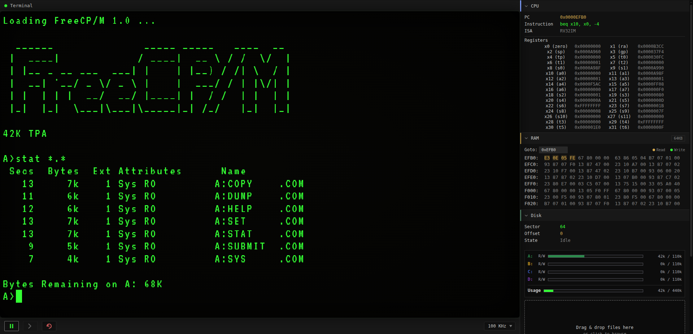

<div align="center">

# Vemu

**A RISC-V microcomputer emulator running FreeCP/M in the browser**

A browser-native 32-bit RISC-V microcomputer emulator designed to boot and run the FreeCP/M operating system

[](https://mazin-o3.github.io/vemu/)
[](LICENSE)

</div>

<p align="center">
  
</p>

## Overview

Vemu simulates a self-contained 32-bit hardware environment inside the browser.

## Hardware Specification

Vemu emulates a custom 32-bit RISC-V microcomputer:

| Component | Specification |
|---|---|
| **CPU** | RV32I + M extension for hardware multiplication and division |
| **RAM** | 64 KB, byte-addressable (`0x0000`–`0xFEFF`) |
| **Memory-mapped I/O** | Top page `0xFF00`–`0xFFFF` |
| **Storage** | 2 MB FreeCP/M disk|
| **System clock** | Selectable 50 kHz – 1 MHz |


## Register Map

| Addr    | Name          | Access | Description                                 |
|---------|---------------|--------|---------------------------------------------|
| `0xFF00`| `DISK_BUFFER` | R/W    | 512-byte sector buffer; each read/write advances the buffer offset |
| `0xFF04`| `DISK_SECTOR` | W      | Select sector: `[15]` write flag, `[14:0]` LBA |
| `0xFF08`| `KBD_DATA`    | R      | Pop next key, `[6:0]` ASCII (bit 7 cleared) |
| `0xFF0C`| `KBD_STATUS`  | R      | `[0]` = 1 if a key is ready; read does not consume |
| `0xFF10`| `DSP_DATA`    | W      | Write a character to the text display       |
| `0xFF14`| `CLK_KHZ`     | R      | System clock frequency in kHz               |
| `0xFF18`| `TIMER_CSTR`  | R/W    | Timer control/status (see bit table)        |
| `0xFF1C`| `TIMER_CNTR`  | R/W    | 16-bit timer counter (writes set it)         |
| `0xFF20`| `DMA_SAR`     | R/W    | DMA source address (16-bit)                 |
| `0xFF24`| `DMA_DAR`     | R/W    | DMA destination address (16-bit)            |
| `0xFF28`| `DMA_WCR`     | R/W    | DMA word count (16-bit)                     |
| `0xFF2C`| `DMA_CSTR`    | R/W    | DMA control (write) / status (read)         |

### DMA_CSTR — `0xFF2C`

Write:

| Bit | Field   | Description                        |
|-----|---------|------------------------------------|
| 0   | START   | Write 1 toggles the transfer on/off |
| 1   | STREAM  | 1 = stream mode (bus-locked)       |
| 2   | SRC_INC | Auto-increment source address      |
| 3   | DST_INC | Auto-increment destination address |
| 5:4 | STEP    | `00` 8-bit, `01` 16-bit, `10` 32-bit |
| 7:6 | —       | Ignored                            |

Read: `[0]` RUNNING (1 = busy), `[1]`–`[5]` readback of STREAM/SRC_INC/DST_INC/STEP, `[7:6]` reads 0.
`STEP` `10` and `11` both decode to 32-bit; writing `11` reads back as `10`.

### TIMER_CSTR — `0xFF18`

| Bit | Field    | Description                      |
|-----|----------|----------------------------------|
| 0   | EN       | 1 = Enabled                      |
| 1   | MOD      | 0 = Continuous, 1 = One-shot     |
| 2   | OVF      | 1 = Overflow; write 1 to clear |
| 5:4 | PRESCALE | `00` 1, `01` 8, `10` 64, `11` 256 |
| 3   | —        | —                                |
| 7:6 | —        | —                                |

### DISK_SECTOR — `0xFF04`

| Bit | Field  | Description                                 |
|-----|--------|---------------------------------------------|
| 15  | WRITE  | 1 = Write buffer to disk, 0 = load sector into buffer |
| 14:0| LBA    | Physical sector number                      |

## FreeCP/M

Vemu boots [FreeCP/M](https://github.com/Mazin-O3/freecpm), a modern take on the classic CP/M operating system.

---

## Running

For local development, `run.sh` serves the site on port 8080. Its optional `build` step recompiles the emulator core first:

```sh
./run.sh          # serve http://localhost:8080
./run.sh build    # rebuild the core, then serve
```

## Regenerating the bundled disk image

`freecpm/bootloader.bin` and `freecpm/disk.img` are produced by the [FreeCP/M](https://github.com/Mazin-O3/freecpm) build:

```sh
git clone https://github.com/Mazin-O3/freecpm
cd freecpm
make -C sysgen
./sysgen/build/sysgen new --disk-size=2048K --mem=64K --platform=vemu --march=rv32im
cp sysgen/build/bootloader.bin sysgen/build/disk.img /path/to/vemu/freecpm/
```

## License

Vemu is distributed under the terms of the open-source [MIT](LICENSE).
