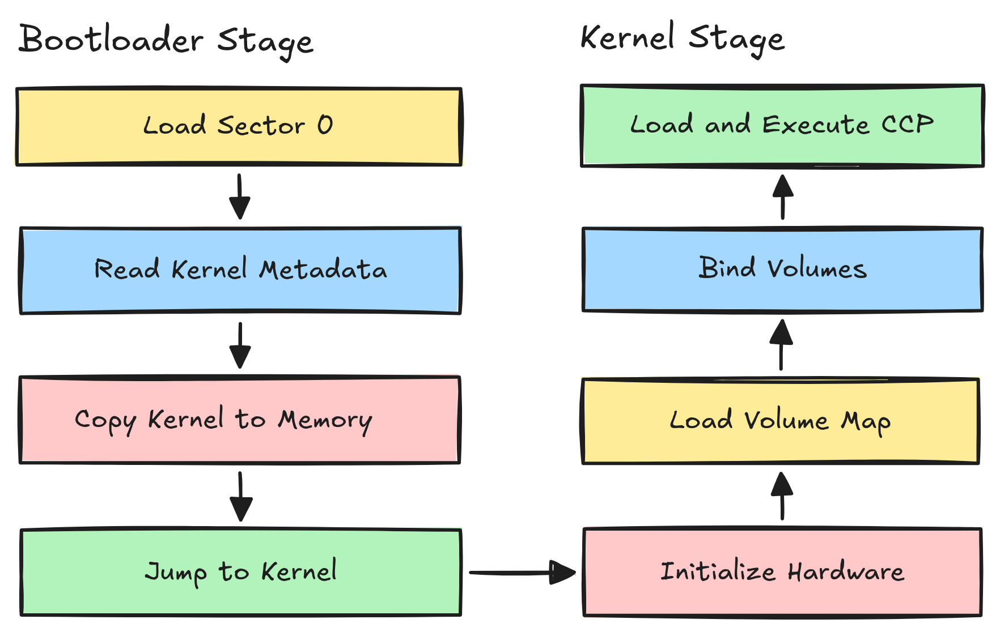
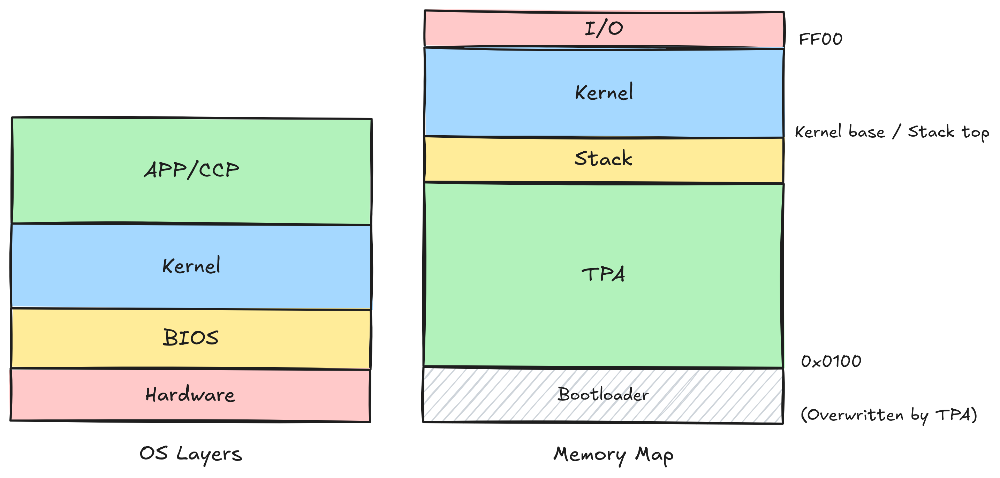
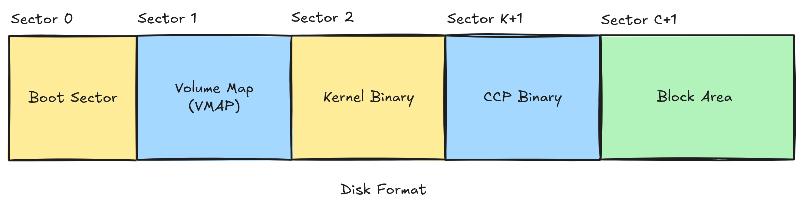

# Vemu

Vemu is An 8-bit inspired RISC-V computer emulator, designed to give a simple environment for learning about computer architecture and operating systems. Try **pico welcome.txt** to get started.

## Boot Process

Think of the machine as a small workshop. CP/M Neo wakes it up in two stages each time it starts: a night-shift worker unlocks the doors, the supervisor sets everything up, and then the front-desk assistant (the CCP) is called in to greet you.

 

- **Stage 1 — The night-shift worker (Bootloader)**: A small program that sets up the CPU, reads disk metadata, copies the kernel from disk to its target address, then jumps to the kernel entry point.

- **Stage 2 — The supervisor (Kernel)**: The Kernel starts by initializing the hardware, reading the volume map and mounting volumes, then loads the Console Command Processor (CCP) from disk and run it. When a program exits, the kernel reloads the CCP from disk.

## OS Architecture

CP/M Neo is a single-user, single-tasking operating system — it runs only one program at a time, and that program has full access to memory above `0x0100`. Think of it as a small workshop where you clear the bench for each new project.

 

- **Memory layout — The workbench**: The Transient Program Area (TPA) runs from `0x0100` up to kernel region. Memory-mapped I/O occupies `0xFF00-0xFFFF` — the wall of dials and switches at the back of the shop.
- **Syscalls — Ringing the bell**: Programs request OS services (open a file, print text, read the keyboard) by calling through a syscall table in kernel memory — like ringing for the supervisor.
- **Environment — Four hooks by the door**: 3 kernel-managed memory slots plus a user slot. Slot 0 holds the syscall table pointer. Slot 1 stores the exit code of the last program. Slot 2 stores the SUBMIT batch offset — the CCP resumes batch from where it left off after each program reload. Slot 3 is free for user programs.
- **Volumes — The storage room map**: The disk is a grid of fixed-size 1 KB blocks. The four volumes (A:–D:) are pre-provisioned from it — each volume gets an equal share — and all four are mounted at boot. Use `SET X: MT` to mount an unmounted volume, `SET X: EX N` to extend it by N KB (blocks), or `SET X: UM N` to shrink it.
- **One program at a time**: One program runs at a time. Running a program overwrites the CCP. When it exits, the kernel reloads the CCP from disk.

## File System

CP/M Neo uses a filesystem inspired by CP/M's BDOS. The disk is divided into **fixed-size 1 KB blocks**. The **4 logical volumes** (A:-D:) are split equally from that block grid, and each volume is formatted and mounted at boot. A volume map (VMAP) records each volume's extents (contiguous runs of blocks) in the disk metadata.

- **User areas — the private rooms**: 16 numbered workspaces (0-15) per volume. Switch with `USER n`.
- **Format — the card catalog**: An extent-based BDOS with 32-byte directory entries. Each extent holds 8 blocks (8 KB), and a file can span up to 256 extents — a 2 MB maximum per volume.
- **8.3 filenames — the book spine**: A filename can have up to 8 characters for the name and 3 characters for the extension. Examples: `HELLO.TXT`, `GAME.BAS`.
- **Max 256 files** per volume: one 256-entry root directory, with each entry tagged with its user area.

Created by <a href="mailto:mazin.mohamed.swe@gmail.com" style="color:#FFB000;text-decoration:none;font-weight:bold;">Eng. Mazin Mohamed</a>
